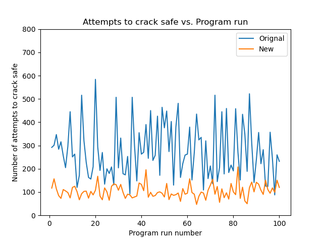

# Efficient Safe Cracker
This is a challenge project from chapter 7 of the book *Impractical Python Projects* by Lee Vaughan.

## The challenge
In this challenge, I was hired by Q-branch of MI6 to build an efficient safe cracker for James Bond to use on a mission in the field. Q-branch already had a safe cracker, but they needed it upgraded to crack digital safe codes quicker to reduce 007's chances of being caught breaking into a megalomaniac's safe. Then I needed to prove to Q that my new safe cracker was faster than the old one.

## The original safe cracker (safe_cracker.py)
The original safe cracker uses a listening mechanism to determine how many digits are in the combination. Then it begins with a combination of all zeros, sets this as its best combination, and listens to determine how many digits are correct. Then it progresses by randomly choosing one digit to change to a random number and entering the new combination. It then listens again for the number of digits that are correct. If the number of correct digits has increased, the safe cracker updates its best combination. The safe cracker iterates in this manner until all the digits have been guessed correctly and the safe is cracked.

## The new and improved safe cracker (efficient_safe_cracker.py)
The new safe cracker uses a similar mechanism, but optimizes it to be faster by adding two new features. First, the new safe cracker detects if the number of correct digits decreased, indicating that the changed digit was correct already. This helps the cracker determine if it initally plugged in a correct value for a digit. The other new feature is a lock on correctly determined digits. The original safe cracker could still randomly choose digits it had already guessed correctly. This resulted in extra attempts that were not beneficial. For my new safe cracker, once a digit is correctly determined it is not longer chosen to guess. Both of these upgrades increased the speed of my safe cracker.

## Convincing Q
James Bond lives life on the edge and can't depend on faulty equipment. Therefore, I had to convince Q that my safe cracker was better than the old one. To prove this, I ran both safe crackers on 100 differently randomly generated safe codes and compared the results.

Below is a graph of the number of attempts it took for each cracker to crack the safe. According to the graph, on only a few occasions did the original safe cracker do as well as the new one.

The average number of attempts to crack the safe:
* Original safe cracker: 276
* New safe cracker: 103

The data is clear that the new safe cracker drastically reduces the amount of time to crack a safe. Q was convinced by the evidence and 007 was issued with the upgraded safe cracker. With the new technology, he will surely stop the next madman bent on world domination!
